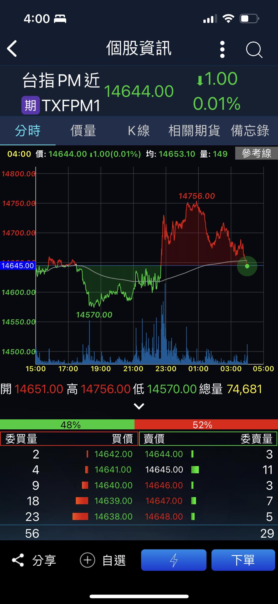

+++
title = "佩洛西行情"
slug = "pelosi-taiwan-market-reaction"
date = "2022-08-03"

[taxonomies]
tags = ["美中關係", "台股"]
authors = ["王冠倫"]
+++

西元 2022 年 8 月 2 日晚間到訪台灣

為表我大中華民國在台灣受國際重視

以及佩洛西成功轉移其內線交易疑慮

台指夜盤旋即展現出友好態勢

又不忘我大中華謙讓美德便於美股收盤時轉趨保守

後人亦稱此行情為「紙老虎行情」

