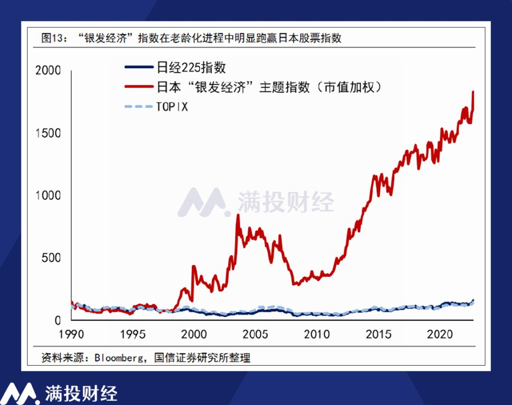
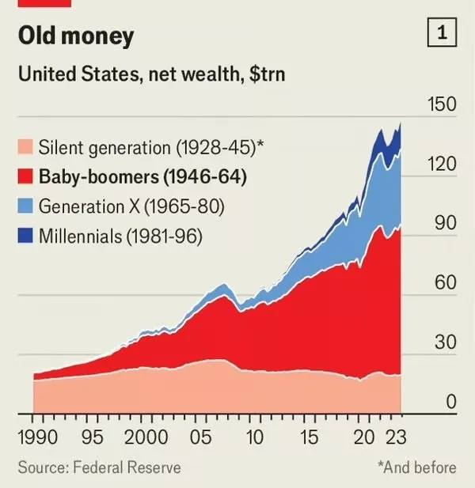
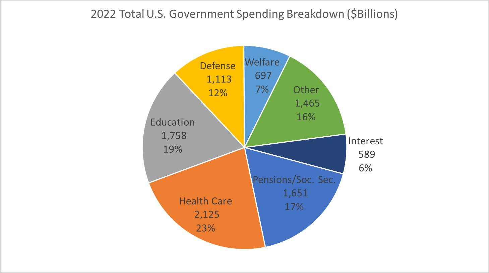

+++
title = "當最富有的一代老去：人口結構如何改寫金融邏輯"
slug = "tw-elder-wealth-risk"
date = "2024-06-19"
updated = "2025-06-20"

[taxonomies]
tags = ["人口老化", "銀髮經濟", "高齡化社會", "資產分配"]
authors = ["王冠倫"]
+++

過去人們常說「老人愈來愈多」，關注的多是醫療負擔、勞動力短缺與社會保障壓力。但從更長期的視角觀察，不難發現人口老化背後的更深層結構變化：**歷史上資產最為集中的世代，正同步步入老年**。這不僅是社會結構的轉折，也正逐步改變資本市場的邏輯與風險樣貌。

本文將從兩個層面探討台灣進入超高齡社會的關鍵轉折：一為宏觀人口結構對經濟體質的長期影響，二為「資本老化」所引發的投資邏輯轉變與金融結構調整。

# 台灣：邁向超高齡社會的臨界點

根據<a href="#reference:ey2025">行政院</a>資料，截至 2024 年，我國 65 歲以上人口佔總人口的 19.18%，已屬高齡社會；<a href="#reference:ndc111">國家發展委員會</a>進一步預測，2025 年將邁入「超高齡社會」門檻，屆時 65 歲以上人口比例將達 20%。
依據主流經濟學對高齡化社會的分析，這樣的人口變化可能帶來以下三項長期趨勢：

1. **利率趨勢走低**：人口老化提高整體儲蓄傾向，資金供給增加，導致資金成本下降。見 <a href="#reference:nechio2016">Nechio (2016)</a> 與 <a href="#reference:gagnon2016">Gagnon et al. (2016)</a>。
2. **投資率趨緩**：高齡社會創新動能削弱，市場成長預期保守，企業實體投資誘因降低。見 <a href="#reference:aksoy2019">Aksoy et al. (2019)</a>。
3. **生產效率放緩**：勞動力結構老化影響技能更新與學習彈性，整體生產力增幅趨緩。見 <a href="#reference:maestas2023">Maestas et al. (2023)</a>。

除了這些結構性趨勢之外，央行的貨幣政策實施方式也隨之調整。<a href="#reference:ihrig2015">Ihrig et al. (2015)</a> 指出，美國聯準會自金融危機以來，因應銀行體系中準備金過剩，逐步轉向以**利率走廊制度**與**超額準備利率（IOR）** 為核心的新政策框架，取代傳統透過調節準備金餘額來控制短期利率的方式。這一制度性轉變反映出，在人口老化與資金過剩的雙重背景下，政策工具亦須隨之演化，以維持利率調控與金融穩定的效果。

儘管如此，這些變化未必呈線性演進，特別是在投資結構與資本配置方面，實際情況可能更為多元且充滿變異，值得持續觀察。

# 國際經驗對照：人口老化下的資本轉型

儘管台灣具備自身特有的產業與資產結構，但從其他高齡化國家的經驗中，仍可獲得一些前瞻性的參考。

## 日本：高齡化與銀髮經濟的資本邏輯變化

<a href="#reference:m2japnum">財經M平方</a>指出，日本早在 2000 年就已進入高齡社會，65 歲以上人口比例約為 17.8%。此後，日本進入所謂「銀髮經濟」時代，與健康照護、醫療與高齡消費相關的產業表現優於大盤指數。如下圖所示：

這意味著，當人口結構發生變化，資本市場的資金流向也隨之重構，不再僅以傳統產業或製造驅動，而逐步轉向高齡友善與健康導向的需求。

## 美國：財富集中與資產配置的風險轉變

根據<a href="#reference:james2024">美國聯準會</a>統計，截至近年，美國淨資產超過一半集中於嬰兒潮世代（1946–1964年出生），此族群多已邁入或即將邁入退休年齡。如下圖：

同時，<a href="#reference:wikipediagsitus">usgovernmentspending.com
 資料</a>顯示西元 2022 年時，美國醫療支出高達 2.1 兆美元，為國防預算兩倍，與社會保障合計占整體支出 40%。如下圖所示：

<a href="#reference:atkins2024">Atkins and Rao (2024)</a> 指出龐大的醫療開支與社會保障支出使政府預算面臨長期壓力，促使退休基金與養老資本改變投資策略，不再偏好低風險資產，而轉向報酬潛力更高、波動性更大的股票與金融資產，以因應「長壽風險」。

這一現象，也可視為「資產高齡化」的具體表現：當擁有資產的人口年齡上升，其風險偏好與資本配置也產生結構性轉變。

# 台灣的投資率迷思：表面穩定、結構轉變

從總體數據看，台灣目前投資率尚未明顯下降，但其結構已有變化跡象，特別是在以下三個面向：

1. **風險承受度提升**：為達成退休後報酬目標，部分資金傾向追逐高波動資產，包括高股息、科技成長股與海外基金。
2. **實體與金融脫鉤**：金融帳面報酬未必對應實質生產力，資本逐漸集中在非實體部門，引發泡沫隱憂。
3. **全球資產聯動性升高**：養老資金跨境配置強化資本市場的同步波動性，使台灣也更容易受到外部金融情勢牽動。

換言之，**資本不再優先流向生產性部門，而更多流向財務性或帳面報酬導向的配置結構**，這正是「資本老化」的本質特徵之一。

# 結語：社會老化與資本邏輯的雙重轉折

總結來說，這場變遷的關鍵，不只是「老人變多」或「老人變有錢」，而是**資產集中於某一特定世代，而該世代正同時老化**。這樣的結構動態，使得退休人口與金融市場的風險偏好之間，產生深度連動。

對政府而言，將面臨難以同時滿足財政可持續性與民眾福利期待的兩難；對個人而言，資產配置與退休策略也需因應結構變遷調整思維。

在這樣的轉折點上，**理解人口老化與資本配置之間的相互作用，將成為未來政策與投資決策不可忽視的基礎。**

# 參考資料

Aksoy, Y., Basso, H. S., Smith, R. P., & Grasl, T. (2019). Demographic structure and macroeconomic trends. *American Economic Journal: Macroeconomics, 11*(1), 193–222. <https://doi.org/10.1257/mac.20170114>

Atkins, A., & Rao, S. (2024, May 21). What a world growing older fast means for investing. *Bloomberg*. [https://www.bloomberg.com/news/articles/2024-05-21/what-a-world-growing-older-fast-means-for-investing](https://archive.ph/NeX0Z)

Gagnon, E., Johannsen, B. K., & Lopez-Salido, D. (2016). Understanding the new normal: The role of demographics (Finance and Economics Discussion Series 2016-080). *Board of Governors of the Federal Reserve System*. <http://dx.doi.org/10.17016/FEDS.2016.080>

Ihrig, J. E., Meade, E. E., & Weinbach, G. C. (2015). Monetary Policy 101: A Primer on the Fed's Changing Approach to Policy Implementation. *Board of Governors of the Federal Reserve System*. <http://dx.doi.org/10.17016/FEDS.2015.047>

Maestas, N., Mullen, K. J., & Powell, D. (2023). The effect of population aging on economic growth, the labor force, and productivity. *American Economic Journal: Macroeconomics, 15*(2), 306–332. <https://doi.org/10.1257/mac.20190196>

MacroMicro 財經M平方. (n.d.). 日本－人口數. *MacroMicro*. [https://www.macromicro.me/charts/654/jp-population](https://archive.ph/P2svC)

McRitchie, J. (2024, May 7). Concentration of wealth. *CorpGov.net*. [https://www.corpgov.net/2024/05/concentration-of-wealth/](https://archive.ph/AMyOR)

滿投財經. (2024, January 19). 銀髮經濟發展迫切，行業潛力或將在政策助推下快速釋放. *36氪*. [https://36kr.com/p/2611349799214983](https://archive.ph/JP1nE)

Nechio, F. (2016, May). Demographics and real interest rates: Inspecting the mechanism. *Federal Reserve Bank of San Francisco*. <https://doi.org/10.24148/wp2016-05>

行政院. (2025, March 24). 人口（國情簡介－人民）. *行政院全球資訊網*. [https://www.ey.gov.tw/state/99B2E89521FC31E1/835a4dc2-2c2d-4ee0-9a36-a0629a5de9f0](https://archive.ph/UG7w2)

國家發展委員會. (n.d.). 高齡化. *國家發展委員會*. [https://www.ndc.gov.tw/Content_List.aspx?n=2688C8F5935982DC](https://archive.ph/jljRT)

Wikipedia. (n.d.). Government spending in the United States. *Wikipedia*. [https://en.wikipedia.org/wiki/Government_spending_in_the_United_States](https://archive.ph/dHwLY)
