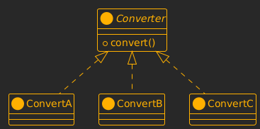
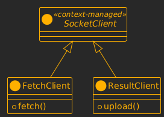
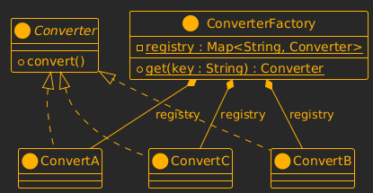
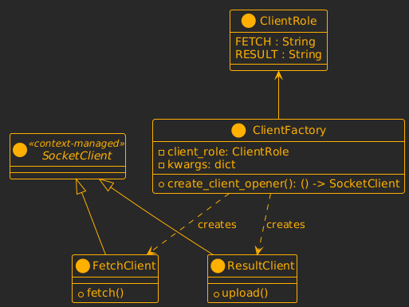
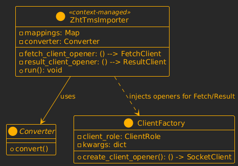
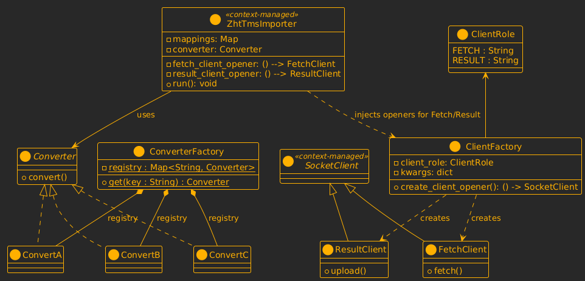

+++
title = "練習：以 SOLID 原則重構雙伺服器資料處理客戶端"
slug = "refactor-client-with-solid-question-answer"
date = "2025-05-20"
updated = "2025-05-30"

[taxonomies]
tags = ["SOLID", "Python", "Socket"]
+++

# 題目背景

你接手了一個需要從「來源伺服器」擷取圖資資料，並將處理後結果傳回「結果伺服器」的任務。現有的 Python 程式碼 `client.py` 雖可正常運作，但可讀性差、耦合度高、不易擴充與測試，缺乏良好的軟體設計。

重點在於能否指出現有設計的問題、提出合理的重構策略，並正確對應至相關的 SOLID 原則。是否構成過度設計，將視你是否有即時確認需求後再進行設計而定。

你收到的專案中已包含以下三個檔案：

1. 客戶端

   目前的 `client.py` 將資料擷取、欄位處理、錯誤處理、結果上傳全部混合在一起，缺乏模組化、可替換性與良好的設計結構。

   <details close>
   <summary><code>client.py</code>（請重構此檔案）</summary>

   ```python
   import socket
   import json

   def import_data_from_zht_tms_tcp(
       mappings, fetch_socket: socket.socket, result_socket: socket.socket, convert: str
   ):
       if fetch_socket.fileno() == -1 or result_socket.fileno() == -1:
           raise RuntimeError("One or more sockets are closed")

       # 對每個目標表格，執行：資料請求、欄位轉換、結果回傳流程
       for dst_table_name, mapping in mappings.items():
           src_table_name = mapping["table"]
           fields = mapping["fields"]
           prepend_cfg = mapping.get("prepend_regions", {})

           # Step 1: 發送 fetch 請求給 source_server
           request = {"type": "fetch", "table": src_table_name, "fields": fields}
           fetch_socket.sendall(json.dumps(request).encode())

           # Step 2: 接收原始資料
           raw = fetch_socket.recv(65536)
           records = json.loads(raw.decode())

           print(f"importing {dst_table_name} from {src_table_name}...")

           # Step 3: 資料轉換
           result = []
           for row in records:
               processed = []
               for field in fields:
                   val = row[field]
                   if field in prepend_cfg:
                       precision = prepend_cfg[field]["precision"]
                       region_code = row["region_code"]
                       if convert == "A":
                           prefix = f"{int(region_code):0{precision}d}"
                           suffix = f"{int(val):0>8}"
                           val = f"{prefix}-{suffix}"
                       elif convert == "B":
                           rev_ufid = str(val)[::-1]
                           rev_region = str(region_code)[::-1]
                           length_info = len(rev_ufid) + len(rev_region)
                           val = f"{rev_ufid}_{rev_region}_len{length_info}"
                       elif convert == "C":
                           encoded = hex(int(val))[2:]
                           combined = f"{encoded}{region_code}"
                           val = combined.rjust(16, "0")
                       else:
                           raise ValueError(f"Unknown conversion type: {convert}")
                   processed.append(val)
               result.append(tuple(processed))

           # Step 4: 傳送處理後結果給 result_server
           upload = {"type": "result", "table": dst_table_name, "data": result}
           result_socket.sendall(json.dumps(upload).encode())

           # Step 5: 等待 server 回應 OK
           ack = result_socket.recv(1024)
           print(f"[Client] Result server 回應：{ack.decode()}")

   if __name__ == "__main__":
       mappings = {
           "table_b": {
               "table": "table_a",
               "fields": ["ufid", "x", "y"],
               "prepend_regions": {"ufid": {"precision": 3}},
           }
       }

       SOURCE_HOST = "127.0.0.1"
       SOURCE_PORT = 50007

       RESULT_HOST = "127.0.0.1"
       RESULT_PORT = 50008

       try:
           with socket.create_connection(
               (SOURCE_HOST, SOURCE_PORT)
           ) as fetch_sock, socket.create_connection(
               (RESULT_HOST, RESULT_PORT)
           ) as result_sock:
               import_data_from_zht_tms_tcp(mappings, fetch_sock, result_sock, convert="B")
       except Exception as e:
           print(f"[Client] Error: {e}")

   ```

   </details>

1. 來源伺服器

   來源伺服器，模擬資料供應商的圖資資料庫。你可發送如下格式的請求取得資料：

   ```python
   {
   "type": "fetch",
   "table": "table_a",
   "fields": ["ufid", "x", "y"]
   }
   ```

   伺服器會傳回每一筆資料，並包含一個額外欄位 `region_code`。

   <details close>
   <summary><code>source_server.py</code>（請勿修改）</summary>

   ```python
   import socket
   import json

   HOST = "127.0.0.1"
   PORT = 50007

   DATABASE = {
       "table_a": [
           {"ufid": "1", "region_code": "12", "x": 111, "y": 12222},
           {"ufid": "2", "region_code": "3", "x": 5555, "y": 1587},
       ]
   }


   def handle_request(data: dict, conn: socket.socket):
       if data.get("type") == "fetch":
           table = data["table"]
           fields = data["fields"]
           rows = DATABASE.get(table, [])
           filtered = [
               {k: row[k] for k in fields + ["region_code"] if k in row} for row in rows
           ]
           conn.sendall(json.dumps(filtered).encode())
       else:
           conn.sendall(b"Unknown request type")


   def start_server():
       with socket.socket(socket.AF_INET, socket.SOCK_STREAM) as s:
           s.bind((HOST, PORT))
           s.listen()
           print(f"[SourceServer] Listening on {HOST}:{PORT}")
           conn, _ = s.accept()
           with conn:
               while True:
                   raw = conn.recv(65536)
                   if not raw:
                       break
                   try:
                       data = json.loads(raw.decode())
                       handle_request(data, conn)
                   except Exception as e:
                       print("Source server error:", e)
                       conn.sendall(b"Error")


   if __name__ == "__main__":
       start_server()
   ```

   </details>

1. 結果伺服器

   結果伺服器，模擬第三方接收並儲存你傳送回去的處理後資料。你可將處理結果用下列格式發送給伺服器：

   ```python
   {
       "type": "result",
       "table": "table_b",
       "data": [
       ["01234567801", 1.2, 3.4],
       ...
       ]
   }
   ```

   伺服器會回應 `OK` 表示接收成功。

   <details close>
   <summary>result_server.py（請勿修改）</summary>

   ```python
   import socket
   import json

   HOST = "127.0.0.1"
   PORT = 50008

   RESULT_STORAGE = {}


   def handle_result(data: dict, conn: socket.socket):
       if data.get("type") == "result":
           table = data["table"]
           records = data["data"]
           RESULT_STORAGE[table] = records
           print(f"[ResultServer] Received result for table {table}:")
           for r in records:
               print(r)
           conn.sendall(b"OK")
       else:
           conn.sendall(b"Unknown request type")


   def start_result_server():
       with socket.socket(socket.AF_INET, socket.SOCK_STREAM) as s:
           s.bind((HOST, PORT))
           s.listen()
           print(f"[ResultServer] Listening on {HOST}:{PORT}")
           conn, _ = s.accept()
           with conn:
               while True:
                   raw = conn.recv(65536)
                   if not raw:
                       break
                   try:
                       data = json.loads(raw.decode())
                       handle_result(data, conn)
                   except Exception as e:
                       print("Result server error:", e)
                       conn.sendall(b"Error")


   if __name__ == "__main__":
       start_result_server()
   ```

   </details>

# 問題分析

原始的 `client.py` 存在以下幾個問題：

1. **違反 SRP（單一職責原則）**：主函式 `main()` 與 `import_data_from_zht_tms_tcp()` 同時負責 socket 建立、資料傳輸、欄位轉換與錯誤處理等多重職責。
2. **違反 OCP（開放封閉原則）**：欄位轉換邏輯直接寫死在主程式中，若要新增轉換邏輯（如 D/E/F 類型），需要修改原始函式。
3. **違反 DIP（依賴反轉原則）**：主程式直接依賴 socket 與傳輸邏輯，無法進行抽象測試或替換實作。
4. **無法測試**：整段邏輯緊密耦合，幾乎不可能單獨測試某一部分。

## 設計提案與需求釐清：應主動確認的方向

在面試情境中，面試者面對模糊的程式碼題目時，除了寫出可運行的版本，更應展現對「可維護性」與「擴充性」的敏感度。然而，若沒有額外說明設計的出發點，很容易造成誤解，導致看起來過度設計或誤解題意。

更成熟的做法是：先簡要說明設計方向，說明這是為了解決哪些情境中的問題，並詢問面試官是否有這類需求存在。

此外，這裡整理出的問題，在現實工作中通常不會等待他人來告訴你「應該怎麼做」，而是作為工程師本身就應具備的判斷力。這可能包括：

- 團隊是否需要高度可測試的模組？

- 轉換規則會不會常變？

- 通訊方式未來可能改變嗎？

- 有沒有 mock/mock 測試的需求？

- 是否有維運人員需要理解系統架構？

因此，本節的設計提案，也可以視為現實中工程師應具備的「架構敏感度」與「需求抽象能力」的演練。

## 應主動釐清的需求問題（附情境假設）

- 是否需要讓 `result_socket.sendall()` 以多線程方式處理？

  （對應：目前上傳結果的流程是同步進行，未額外使用 `threading` 或 `asyncio` 等非同步工具）

  **Q:** 我注意到 `result_socket.sendall()` 是同步阻塞的呼叫。如果資料量變大或伺服器回應變慢，是否需要考慮讓這部分以非同步方式或多線程進行處理，以避免卡住整個流程？

  **A:** 不需要，目前這段程式的定位是批次匯入工具，而不是高吞吐量的持續服務。我們希望所有處理步驟能維持順序、便於追蹤錯誤；而非同步或多線程上傳會讓錯誤追蹤與除錯更複雜，也不符合目前匯入工作流程的需求。

- 是否該假定主程式永遠會處理好 socket？

  （對應：所有 `__enter__`, `__exit__` 的上下文管理設計）

  **Q:** 在 `client.py` 中，`import_data_from_zht_tms_tcp` 是直接接收建立好的 socket。我是否該假定呼叫者一定會在外部正確建立與關閉 socket？還是我應該在設計中考慮 socket 的生命週期管理？

  **A:** 你可以視為由你這邊全權負責比較好。我們希望這段邏輯在內部就能管理 socket 的開啟與關閉，這樣比較不容易出錯，也能讓使用者專注在邏輯配置上。

- 是否需要把資料來源與上傳目標區分為不同模組？

  （對應：`FetchClient` 與 `ResultClient` 分開）

  **Q:** 擷取資料與上傳結果的邏輯可以分開處理嗎？它們未來可能獨立變更嗎？

  **A:** 有可能。我們曾考慮讓結果伺服器改用其他協定或格式，所以這兩部分確實可能各自變動。

- 是否預期主程式會需要介入 socket 的細節操作？

  （對應：`SocketClient` 抽象類別，用來隱藏通訊細節與連線管理）

  **Q:** 未來是否會有需要讓主程式手動對 socket 連線做細部操作（例如更換傳輸協定、手動重連、改變超時設定等）？還是我們可以預期主程式永遠只需要透過一個統一介面來傳送與接收資料？

  **A:** 我們預期主程式應該不需要管 socket 細節。連線建立與關閉只要在通訊元件內部管理好即可。

- 是否需要強制根據角色選用對應的通訊類別？

  （對應：`ClientFactory.create_client_opener()` 依據角色產生對應 `FetchClient` 或 `ResultClient`）

  **Q:** 在使用者建立通訊元件時，是否應該強制讓「擷取資料」只能使用 `FetchClient`、「上傳結果」只能使用 `ResultClient`？也就是說，角色與實作是否是一對一對應，不能混用？

  **A:** 是的，我們希望角色和實作是明確對應的，避免誤用。例如不能用處理結果的 client 去擷取資料，這樣能降低錯誤與混淆。

- 是否需要讓欄位要不要轉換的邏輯保留在主程式？

  （對應：在 `ZhtTmsImporter._process_record()` 中主動判斷是否轉換）

  **Q:** 未來是否有可能會新增或變更哪些欄位需要轉換？如果有這樣的需求，是不是應該讓「要不要轉換」的邏輯保留在主程式，而不是寫死在轉換器裡？

  **A:** 是的，哪些欄位需要轉換是根據上游欄位配置來調整的，因此應該由主程式決定，不應該放進轉換器裡。

- 是否需要抽離轉換邏輯？

  （對應：`Converter` 介面 + `ConvertA/B/C` 實作）

  **Q:** 請問這些轉換邏輯（像 `A`、`B`、`C`）是否有可能根據需求變動？或者未來會加入新的轉換方式？

  **A:** 是的，這些規則可能因不同地區或資料型態而變，未來也可能會新增新的格式。

# 重構步驟與設計說明

以下內容依據重構邏輯分為數個步驟，逐一說明各項設計缺陷、重構對應的 SOLID 原則、以及實作調整的具體做法。透過這些步驟，可以清楚觀察設計品質如何隨著重構逐步提升。

## 步驟一：封裝欄位轉換邏輯（SRP + OCP + LSP + ISP）

我們首先針對欄位轉換邏輯進行重構。原本在主流程中以 `if convert == "A"`、`"B"`、`"C"` 等條件分支控制不同的轉換邏輯，不僅冗長，也讓流程與格式處理細節高度耦合。每新增一種轉換規則，就得改動主邏輯本身，這種設計既不直觀，也不易維護。

為了讓轉換邏輯更具彈性且易於擴充，我們將這些條件式提取出來，並統一定義為一組具有一致行為的轉換介面。具體做法是建立 `Converter` 抽象介面（在實作上是一個 Python 的抽象類別 `ABC`），明確定義所有轉換器應該具備的轉換方法，並針對每種轉換方式（如 `A`、`B`、`C`）個別實作對應的子類別，例如 `ConvertA`、`ConvertB`、`ConvertC`。

這樣的調整使每個轉換器類別只負責一種欄位轉換邏輯，而主流程則專注於資料匯入的整體流程，不再同時處理格式細節與分支邏輯，這正是 **SRP（單一職責原則）** 的體現。

透過 `Converter` 抽象介面的設計，我們可以在未來有新的轉換需求時，僅需新增一個類別並將其註冊進轉換器選擇邏輯中，原有流程無需變動。這樣的設計具備良好的擴充性，正反映出 **OCP（開放封閉原則）** 所強調的精神：**對擴充開放，對修改封閉**。

更重要的是，主流程僅依賴 `Converter` 抽象介面，不需知道實際用的是 `ConvertA`、`ConvertB` 還是 `ConvertC`。只要這些轉換器都有相同的方法介面（也就是都實作 `convert` 方法），就能在**不更動主程式邏輯的情況下互相替換**，這也正是 **LSP（里氏替換原則）** 所強調的重點。

此外，`Converter` 抽象介面僅定義一個必要方法 `convert()`，讓每個轉換器只需實作其實際用途的功能，不必被迫處理不相關的行為。這樣的設計也符合 **ISP（介面隔離原則） 的精神：介面應精簡、明確，避免造成實作者與使用者的負擔**。

<details open>
<summary>UML</summary>



</details>

<details close>
<summary>語法範例</summary>

```python
class Converter(ABC):
    @abstractmethod
    def convert(self, value: str, region_code: str, precision: int) -> str:
        # 定義轉換器需要實作的抽象方法
        pass

class ConvertA(Converter):
    def convert(self, value: str, region_code: str, precision: int) -> str:
        # 原本 A 的方法（見 client.py 中的 if convert == "A"）

class ConvertB(Converter):
    def convert(self, value: str, region_code: str, precision: int) -> str:
        # 原本 B 的方法（見 client.py 中的 if convert == "B"）

class ConvertC(Converter):
    def convert(self, value: str, region_code: str, precision: int) -> str:
        # 原本 C 的方法（見 client.py 中的 if convert == "C"）
```

</details>

## 步驟二：抽象 Socket 行為（SRP + DIP）

原始的 `client.py` 中，主流程直接建立並操作兩個 socket（`fetch_socket` 與 `result_socket`），並透過它們執行資料請求與上傳。這種設計使得 socket 建立、資料傳輸與錯誤處理等行為全都交織在同一段流程中，導致職責混雜、重複邏輯出現，也讓主程式難以閱讀與測試。

為了解耦 socket 操作與業務邏輯，我們將 socket 行為抽象出來，定義一個 `SocketClient` 抽象介面，並針對不同用途分別實作 `FetchClient` 與 `ResultClient`。每個類別只負責一種 socket 行為：`FetchClient` 專注於資料請求、`ResultClient` 專注於資料上傳。這種設計讓每個類別只有一個修改的理由，符合 **SRP（單一職責原則）**。同時，將不同用途的 socket 操作拆分為不同模組，也落實了 **SoC（Separation of Concerns，關注點分離）** 的精神，讓各個模組的邊界與責任更清晰。

此外，這些 socket client 實作了 `__enter__()` 與 `__exit__()`，可以被 `with` 語法使用，自動管理 socket 開啟與關閉，避免資源釋放遺漏，讓資源操作的流程也保持清晰與集中。這個作法來自 C++ 中的 **RAII（Resource Acquisition Is Initialization）**，目的是讓資源管理「自動且不可忽略」。在 Python 中，這正是 context manager 的典型用途。

特別值得注意的是，`SocketClient` 並未提供 `open()` 或 `close()` 等方法，而是 **只定義了 `__enter__` / `__exit__` 兩個抽象方法**。這代表我們在設計上**明確要求呼叫端必須透過 `with` 語法來使用 socket client**，統一資源的開啟與釋放流程，並避免開啟後忘記關閉等潛在錯誤。

Socket client 的實作也讓每個使用 socket 的地方 **不再需要重複處理錯誤與釋放邏輯**，符合 **DRY（Don't Repeat Yourself）的精神： 相同邏輯不應重複出現在多處，應封裝成單一實體**。

更進一步地，主程式不再直接建立 socket 或依賴 `FetchClient`、`ResultClient` 這些具體類別，而是透過 `SocketClient` 抽象介面，分別與資料請求與結果上傳模組進行互動。這樣一來，高階邏輯（主流程）只需依賴統一的抽象介面，而不需耦合具體的實作細節，這正是 **DIP（依賴反轉原則）** 的應用。

值得一提的是，雖然目前 `FetchClient` 與 `ResultClient` 都繼承自 `SocketClient`，但主流程對它們的使用方式是分開且明確的，兩者並不會互相替換。因此這裡的設計重點，在於統一資源管理與抽象依賴的方式，而非強調轉換器那種可交換的多型結構（如 LSP）。若未來有多種資料來源類型（例如 `HttpFetchClient`、`FileFetchClient` 等），我們可以再進一步為 `FetchClient` 拆出專用的抽象介面（例如 `FetchClientBase`），讓主流程依賴這個行為介面即可。但目前的需求尚未涉及這樣的變化，因此我們選擇僅抽象出 `SocketClient` 來統一資源存取行為，不進行過度設計。這樣的設計保留了彈性，同時維持簡潔性，也符合實務開發中適度設計的原則。

<details open>
<summary>UML</summary>



</details>

<details close>
<summary>語法範例</summary>

```python
class SocketClient(ABC):
    @abstractmethod
    def __enter__(self) -> "SocketClient":
        # 定義開啟 socket 並回傳自身的抽象方法
        pass

    @abstractmethod
    def __exit__(self, exc_type, exc_val, exc_tb) -> None:
        # 定義自動釋放 socket 資源的抽象方法
        pass

    # 這個介面只提供 __enter__ / __exit__ 方法，而沒有提供 open() / close()，
    # 表示設計上是為了讓呼叫端必須透過 with 語法來使用，統一資源的開啟與釋放流程。

class FetchClient(SocketClient):
    def fetch(self, table, fields) -> list[dict]:
        # 原本從 fetch_socket 發送請求並接收資料的邏輯
        pass

class ResultClient(SocketClient):
    def upload(self, table: str, data: list) -> None:
        # 原本將資料透過 result_socket 傳送出去的邏輯
        pass
```

</details>

## 步驟三：引入 Factory 簡化初始化流程（OCP + DIP）

在重構過程中，我們將欄位轉換器與 socket client 分別抽象為 `Converter` 與 `SocketClient` 介面，讓主流程能依賴抽象而非具體實作。然而，主程式一方面需根據使用者輸入決定轉換器類型（例如 "A"、"B"、"C"），另一方面也需要初始化與伺服器溝通所需的 client 實例。若將這些初始化邏輯直接寫在主流程中，會讓高階邏輯被迫耦合底層細節，不利於維護與測試。

為了進一步簡化主流程並降低耦合，我們引入了兩個工廠類別：

- `ConverterFactory`：根據轉換類型產生對應的 `Converter` 實例
- `ClientFactory`：依據角色產生 client 的初始化函式（如 `FetchClient` 或 `ResultClient`）

這兩個工廠在實作上採用了不同的策略，分別反映了其輸入來源與使用情境的差異：

- `ConverterFactory` 是資料驅動的，轉換類型由外部輸入決定，因此透過 `_registry` 字典集中管理所有類型與對應物件，方便未來擴充與註冊。
- `ClientFactory` 則面對的是系統內部角色（如 `fetch`、`result`），類型固定且語意明確，因此使用 `Enum` 搭配 `match-case`，讓邏輯更具可讀性與可控性。

這些工廠的設計讓主流程只需指定「角色」或「類型」，即可取得對應的實例或初始化函式，無需知道其建立細節。這種將實例建立責任交由外部工廠管理的做法，是 **DIP（依賴反轉原則）** 的具體應用。

其中，`ClientFactory` 採用延遲初始化的設計，根據角色（如 "fetch" 或 "result"）與參數（如 host 與 port）動態產生一個可呼叫的初始化函式。這讓主程式能在合適的時機（例如 `ZhtTmsImporter.__enter__()`）開啟連線，進一步隔離資源控制與邏輯流程。

此外，當未來需要支援更多 client 類型（例如 `FileFetchClient` 或 `HttpFetchClient`）時，只需擴充 `ClientFactory` 的分支邏輯即可，主程式則可完全不變。這正體現了 **OCP（開放封閉原則）** 的精神：**對擴充開放，對修改封閉**。

<details open>
<summary>使用情境對照表</summary>

| 工廠類別           | 對應方式         | 適用情境                           |
| ------------------ | ---------------- | ---------------------------------- |
| `ConverterFactory` | `_registry` 字典 | 類型可擴充、對應單一行為、資料驅動 |
| `ClientFactory`    | `Enum + match`   | 類型固定、語意明確、邏輯需個別控制 |

</details>

- <details open>
  <summary><code>ConverterFactory</code>:</summary>

    - <details open>
        <summary>UML</summary>

        

        </details>

    - <details close>
        <summary>語法範例</summary>:

        ```python
        class ConverterFactory:
            _registry = {
                "A": ConvertA(),
                "B": ConvertB(),
                "C": ConvertC(),
            }

            @classmethod
            def get(cls, key: str) -> Converter:
                if key not in cls._registry:
                    raise ValueError(f"Unsupported convert type: {key}")
                return cls._registry[key]
        ```

        </details>
    </details>

- <details open>
  <summary><code>ClientFactory</code>:</summary>

  - <details open>
    <summary>UML</summary>

    

    </details>

  - <details close>
    <summary>語法範例</summary>:

    ```python
    class ClientRole(str, Enum):
        FETCH = "fetch"
        RESULT = "result"

    class ClientFactory:
        def __init__(self, client_role: ClientRole | str, **kwargs) -> None:
            self.client_role = client_role
            self.kwargs = kwargs

        def create_client_opener(self) -> Callable[[], SocketClient]:
            def factory() -> SocketClient:
                match self.client_role.lower():
                    case ClientRole.FETCH:
                        return FetchClient(self.kwargs["host"], self.kwargs["port"])
                    case ClientRole.RESULT:
                        return ResultClient(self.kwargs["host"], self.kwargs["port"])
                    case _:
                        raise ValueError(f"Unknown client role: {self.client_role}")

            return factory
    ```

    </details>

</details close>

## 步驟四：導入 ZhtTmsImporter 主導流程（SRP + DIP）

在原始的 `client.py` 中，`import_data_from_zht_tms_tcp()` 函式一次處理了資料擷取、欄位轉換與結果上傳等所有流程。雖然功能完整，卻也導致邏輯過於集中，無法單獨測試每個步驟、也難以替換特定行為，例如更換轉換邏輯或 socket 實作。

為了讓主流程更清晰、結構更可維護，我們引入一個新的類別 `ZhtTmsImporter` 作為主導流程的組織者。這個類別的責任很單純：串接 fetch、convert、upload 三個階段，但不自行處理任何細節。

具體來說，`ZhtTmsImporter` 的建構子會接收下列元件作為參數：

- 欄位轉換器（`Converter` 介面實作）
- 資料請求 client 的開啟函式
- 資料上傳 client 的開啟函式

這些元件都是透過 **依賴注入（Dependency Injection）** 提供的，讓 `ZhtTmsImporter` 不需要知道具體實作，只要依照介面使用即可。這樣設計使得轉換器或 client 行為可以輕易替換，主流程完全不受影響，這正是 **DIP（依賴反轉原則）** 的應用。

另一方面，`ZhtTmsImporter` 也僅負責「統籌流程」，不內嵌細節操作，這樣的責任劃分讓類別結構更清楚，符合 **SRP（單一職責原則）**。若未來流程變動，只需修改這個類別，而不會影響其他模組。

此外，`ZhtTmsImporter` 本身也支援 context manager（`__enter__` / `__exit__`），負責開啟與關閉內部所需的 socket client。這讓它可以用在 `with` 區塊中，進一步強化了資源管理的整潔性。

<details open>
<summary>UML</summary>



</details>

<details close>
<summary>語法範例</summary>

```python
class ZhtTmsImporter:
    def __init__(
        self,
        mappings: dict,
        converter: Converter,
        fetch_client_opener: Callable[[], FetchClient],
        result_client_opener: Callable[[], ResultClient],
    ) -> None:
        # 將所有依賴元件透過建構子注入，提升彈性與可測試性

    def __enter__(self) -> "ZhtTmsImporter":
        # 在 with 區塊中自動開啟 socket client

    def __exit__(self, exc_type, exc_val, exc_tb) -> None:
        # 離開 with 區塊時釋放資源

    def _process_record(self, row: dict, fields: list, prepend_cfg: dict) -> tuple:
        # 將欄位依照規則轉換後打包成 tuple

    def run(self) -> None:
        # 主流程邏輯：依 mappings 對每張表格執行 fetch → convert → upload
```

</details>

## 小結：SOLID 原則落實對照表

| 原則 | 對應步驟       | 重構實例                                                              | 實現方式                                          |
| ---- | -------------- | --------------------------------------------------------------------- | ------------------------------------------------- |
| SRP  | 步驟一、三、四 | `Converter`、`FetchClient`、`ResultClient`、`ZhtTmsImporter` 各司其職 | 每個類別專責一種行為，避免混雜責任                |
| OCP  | 步驟一、二     | 支援多種轉換器與 client 初始化方式                                    | 將建立邏輯封裝於工廠中，新增類型不需修改主流程    |
| LSP  | 步驟一         | 所有 `Converter` 子類皆可被替換使用                                   | 主流程僅依賴抽象，不需得知具體類型                |
| ISP  | 步驟一         | `Converter` 介面僅定義必要方法                                        | 各轉換器只需實作 `convert` 方法，避免實作無關邏輯 |
| DIP  | 步驟二、三、四 | `ZhtTmsImporter` 依賴抽象的轉換器與 client 開啟方式                   | 實作細節由外部注入，主流程僅依賴抽象              |

## 實作結果參考

為了方便評分者對照測驗者所指出的設計項目與實作結果，下列程式碼特地整理在同一檔案中。實務上這些內容應該分開實作，這裡只是為了閱讀清楚所作的簡化。

<details open>
<summary>UML</summary>



</details>

<details close>
<summary><code>client.py</code></summary>

```python
import json
import socket
import types
from abc import ABC, abstractmethod
from enum import Enum
from typing import Callable, cast


# === Interface for Converters ===
class Converter(ABC):
    @abstractmethod
    def convert(self, value: str, region_code: str, precision: int) -> str:
        pass


# === Implementations of Converters ===
class ConvertA(Converter):
    def convert(self, value: str, region_code: str, precision: int) -> str:
        prefix = f"{int(region_code):0{precision}d}"
        suffix = f"{int(value):0>8}"
        return f"{prefix}-{suffix}"


class ConvertB(Converter):
    def convert(self, value: str, region_code: str, precision: int) -> str:
        rev_ufid = str(value)[::-1]
        rev_region = str(region_code)[::-1]
        length_info = len(rev_ufid) + len(rev_region)
        return f"{rev_ufid}_{rev_region}_len{length_info}"


class ConvertC(Converter):
    def convert(self, value: str, region_code: str, precision: int) -> str:
        encoded = hex(int(value))[2:]
        combined = f"{encoded}{region_code}"
        return combined.rjust(16, "0")


# === Converter Factory ===
class ConverterFactory:
    _registry = {
        "A": ConvertA(),
        "B": ConvertB(),
        "C": ConvertC(),
    }

    @classmethod
    def get(cls, key: str) -> Converter:
        if key not in cls._registry:
            raise ValueError(f"Unsupported convert type: {key}")
        return cls._registry[key]


# === Abstract Socket Client ===
class SocketClient(ABC):
    @abstractmethod
    def __enter__(self) -> "SocketClient":
        pass

    @abstractmethod
    def __exit__(
        self,
        exc_type: type[BaseException] | None,
        exc_val: BaseException | None,
        exc_tb: types.TracebackType | None,
    ) -> None:
        pass


# === Socket clients ===
class FetchClient(SocketClient):
    def __init__(self, host: str, port: int) -> None:
        self.host = host
        self.port = port

    def __enter__(self) -> "FetchClient":
        self.socket = socket.create_connection((self.host, self.port))
        return self

    def __exit__(
        self,
        exc_type: type[BaseException] | None,
        exc_val: BaseException | None,
        exc_tb: types.TracebackType | None,
    ) -> None:
        self.socket.close()

    def fetch(self, table, fields) -> list[dict]:
        request = {"type": "fetch", "table": table, "fields": fields}
        self.socket.sendall(json.dumps(request).encode())
        raw = self.socket.recv(65536)
        return json.loads(raw.decode())


class ResultClient(SocketClient):
    def __init__(self, host: str, port: int) -> None:
        self.host = host
        self.port = port

    def __enter__(self) -> "ResultClient":
        self.socket = socket.create_connection((self.host, self.port))
        return self

    def __exit__(
        self,
        exc_type: type[BaseException] | None,
        exc_val: BaseException | None,
        exc_tb: types.TracebackType | None,
    ) -> None:
        self.socket.close()

    def upload(self, table: str, data: list) -> None:
        payload = {"type": "result", "table": table, "data": data}
        self.socket.sendall(json.dumps(payload).encode())
        ack = self.socket.recv(1024)
        print(f"[Client] Result server 回應：{ack.decode()}")


# === Main Importer Class ===
class ZhtTmsImporter:
    def __enter__(self) -> "ZhtTmsImporter":
        self._fetch_cm = self.fetch_client_opener()
        self._result_cm = self.result_client_opener()
        self.fetch_client = self._fetch_cm.__enter__()
        self.result_client = self._result_cm.__enter__()
        return self

    def __exit__(
        self,
        exc_type: type[BaseException] | None,
        exc_val: BaseException | None,
        exc_tb: types.TracebackType | None,
    ) -> None:
        self._fetch_cm.__exit__(exc_type, exc_val, exc_tb)
        self._result_cm.__exit__(exc_type, exc_val, exc_tb)

    def __init__(
        self,
        mappings: dict,
        converter: Converter,
        fetch_client_opener: Callable[[], FetchClient],
        result_client_opener: Callable[[], ResultClient],
    ) -> None:
        self.mappings = mappings
        self.converter = converter
        self.fetch_client_opener = fetch_client_opener
        self.result_client_opener = result_client_opener

    def _process_record(
        self, row: dict, fields: list, prepend_cfg: dict
    ) -> tuple[str | int]:
        processed = []
        for field in fields:
            val = row[field]
            if field in prepend_cfg:
                precision = prepend_cfg[field]["precision"]
                region_code = row["region_code"]
                val = self.converter.convert(val, region_code, precision)
            processed.append(val)
        return tuple(processed)

    def run(self) -> None:
        for dst_table_name, mapping in self.mappings.items():
            src_table_name = mapping["table"]
            fields = mapping["fields"]
            prepend_cfg = mapping.get("prepend_regions", {})

            records = self.fetch_client.fetch(src_table_name, fields)
            print(f"importing {dst_table_name} from {src_table_name}...")

            result = [self._process_record(row, fields, prepend_cfg) for row in records]
            self.result_client.upload(dst_table_name, result)


# === Client Role Enum ===
class ClientRole(str, Enum):
    FETCH = "fetch"
    RESULT = "result"


# === Client Factory ===
class ClientFactory:
    def __init__(self, client_role: ClientRole | str, **kwargs) -> None:
        self.client_role = client_role
        self.kwargs = kwargs

    def create_client_opener(self) -> Callable[[], SocketClient]:
        def factory() -> SocketClient:
            match self.client_role.lower():
                case ClientRole.FETCH:
                    return FetchClient(self.kwargs["host"], self.kwargs["port"])
                case ClientRole.RESULT:
                    return ResultClient(self.kwargs["host"], self.kwargs["port"])
                case _:
                    raise ValueError(f"Unknown client role: {self.client_role}")

        return factory


if __name__ == "__main__":
    SOURCE_HOST = "127.0.0.1"
    SOURCE_PORT = 50007
    RESULT_HOST = "127.0.0.1"
    RESULT_PORT = 50008
    mappings = {
        "table_b": {
            "table": "table_a",
            "fields": ["ufid", "x", "y"],
            "prepend_regions": {"ufid": {"precision": 3}},
        }
    }

    converter = ConverterFactory.get("B")
    fetch_client_opener = cast(
        Callable[[], FetchClient],
        ClientFactory(
            ClientRole.FETCH, host=SOURCE_HOST, port=SOURCE_PORT
        ).create_client_opener(),
    )
    result_client_opener = cast(
        Callable[[], ResultClient],
        ClientFactory(
            ClientRole.RESULT, host=RESULT_HOST, port=RESULT_PORT
        ).create_client_opener(),
    )
    with ZhtTmsImporter(
        mappings, converter, fetch_client_opener, result_client_opener
    ) as importer:
        importer.run()
```

</details>

# 評分

本題著重於 SOLID 原則在實務中的應用能力。以下列出各評分項目所對應的設計重點與評估準則，供閱卷與自我檢核參考。

## 評分項目

本表為本題之 SOLID 原則應用能力評分指標，測驗者需觀察原始程式碼中可重構的設計缺陷，並說明其重構方向與原因。每一項重構對應一至多個 SOLID 原則，並依據拆解細緻度與設計觀念深度給予對應分數。總分為 100 分。

| 大項               | 項目                             | 重構目標                                                  | 涉及原則 | 滿分 |
| ------------------ | -------------------------------- | --------------------------------------------------------- | -------- | ---- |
| 資源的封裝與管理   | Socket 操作與邏輯耦合            | 避免與邏輯混用，並注意到 socket 開關狀態                  | SRP, DIP | 15   |
|                    | 使用上下文管理器管理 socket 資源 | 使用 `with` 管理 socket 資源釋放                          | SRP      | 5    |
|                    | Client 類別的分工                | 將 `FetchClient` 與 `ResultClient` 拆開                   | SRP      | 10   |
| 邏輯抽象與擴充設計 | 資料轉換流程的分支邏輯           | 消除 `if convert == "A"` 這類條件式                       | OCP, SRP | 15   |
|                    | 每種轉換邏輯的封裝               | 將 `A`/`B`/`C` 的轉換封裝為獨立類別                       | SRP, OCP | 10   |
|                    | 統一轉換介面 (Interface)         | 實作 `Converter` 介面                                     | ISP, DIP | 10   |
|                    | 遵循 LSP 的轉換器設計            | 每個轉換器都能被 `Converter` 替換，主流程不需知道具體類型 | LSP      | 10   |
| 流程設計與依賴解耦 | 將主要匯入流程包成一個類別       | 將整體流程物件化（如 `ZhtTmsImporter`）                   | SRP      | 10   |
|                    | 解耦產生 `Converter` 方式        | 使用 `ConverterFactory` 管理轉換類別                      | OCP, DIP | 10   |
|                    | 統一 client 產生流程             | 使用 `ConverterFactory.create_client_opener` 產生 client  | OCP      | 5    |

## 能力參考

本題屬於設計判斷題，測驗是否具備辨識程式設計問題與應用 SOLID 原則進行重構設計的能力。以下評分等級可作為評估測驗者表現的參考依據：

- **初階**僅能指出程式碼過於複雜或存在多重職責，可能不具備應用 SOLID 原則的能力。

- **中階**指出應拆分函式或類別，並初步理解單一職責與擴充性設計，具備 Clean Code 基礎能力。

- **進階**能明確指出多項潛在的設計問題，並以 SOLID 原則為依據提出合理的重構方向，說明具邏輯性、具系統性，展現良好軟體設計直覺。

- **高階**則能全面分析現有設計問題，並提出具架構性的重構建議，展現高層次的設計抽象與原則運用能力。

| 等級 | 特徵                                                               | 分數範圍 |
| ---- | ------------------------------------------------------------------ | -------- |
| 初階 | 僅指出程式可拆分、函式太長、有多重 if-else                         | 0–39     |
| 中階 | 知道將轉換邏輯寫成 function/class，理解 SRP/OCP 概念               | 40–69    |
| 進階 | 明確指出 interface、模組化設計、上下文管理器的應用，熟練操作 SOLID | 70–89    |
| 高階 | 能整體分析架構，統整多項原則提出完整重構方案                       | 90–100   |

# 結語

透過本題的練習，我們將一份結構混亂、邏輯耦合的 `client.py` 重構為符合 SOLID 原則的版本，並在設計上兼顧了可讀性、可擴充性與可測試性。這份題目表面上是 socket 與轉換邏輯的整合任務，實際上則考驗了開發者對軟體設計原則的理解與取捨能力。

在重構過程中，我們不僅強化了物件的職責分離與介面穩定性，也刻意保留設計的彈性邊界。這樣的設計態度不僅展現了 SOLID 原則的實務精神，也符合現代軟體開發對「可演化架構」的期待。

希望這份題解能幫助讀者理解 SOLID 原則在真實工程場景中的應用方式，並為日後面對類似設計挑戰建立清晰的思考框架。
